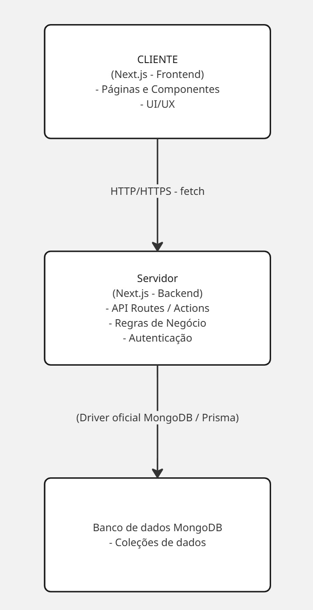

Descrição da arquitetura:

- Na arquitetura Cliente-Servidor. O Cliente se refere a qualquer dispositivo (computador, smartphone ou tablet) que através da página web inicia a comunicação solicitando um recurso ao servidor. O Servidor nesse projeto será o servidor do Next.js que receberá a soliticação da página web e ira interagir com o banco de dados podendo retornar para a página web os dados ou alterar, criar e deletar. Além disso, o servidor também poderá interagir com o banco de imagens (cloudinary)

Interface:

- Header, Footer, Home, Sobre, Login, Registrar-se, usuários, ongs

Servidor:

- Next.js + Node.js

Banco de dados:

- MongoDB

Banco de imagems:

- Cloudinary

Usuários:

- Admin, usuários autenticados (logados) e visitantes (usuários não logado)

Infraestrutura:

- Hospedar na Vercel (ótimo para projetos Next.js)

Padrões arquiteturais utilizados:

- Client Server

Diagrama de arquitetura:

Decisões técnicas e justificativas:

- Optamos por subir o projeto na Vercel, pois é a hospedagem ideal para projetos Next.js

- Optamos por não usar API request em diversas partes do projeto, porque o sistema se tornará mais otimizado se fizermos as requisições ao banco de dados através do Server Actions e não por API

- Na parte de autenticação na tentativa de Login, preferimos usar o Next-Auth ao invés de criarmos nosso próprio meio de autenticação, porque assim pouparemos tempo com um trabalho a menos e ainda aproveitaremos a segurança do Next-Auth
