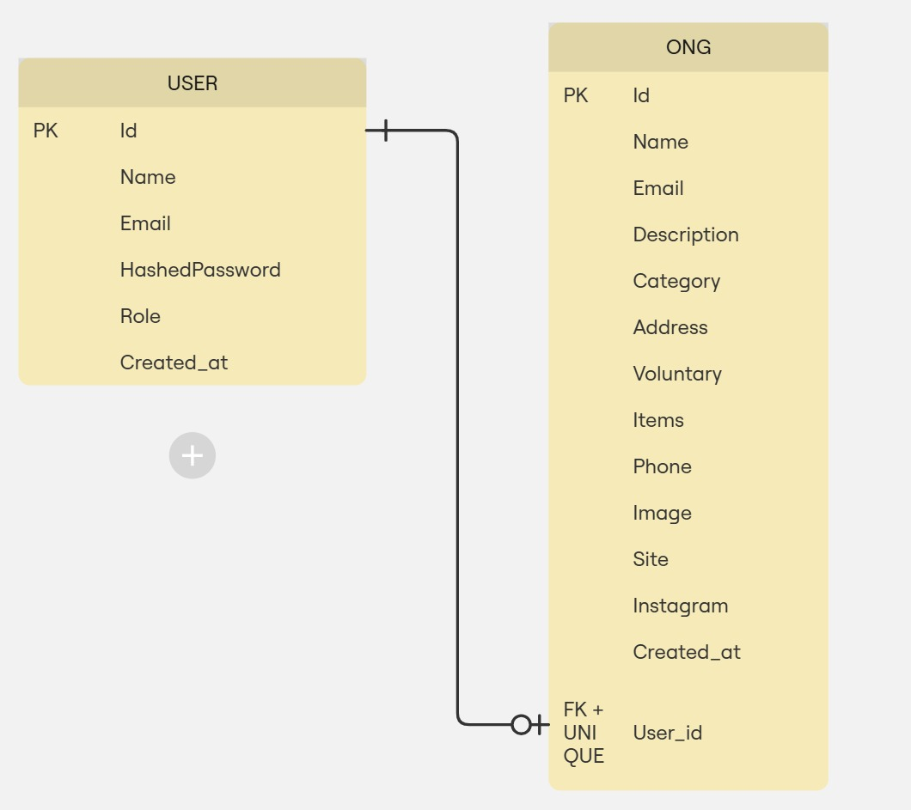

Diagrama ER: 

USER:
-Id (String): Id para identificação do usuário, é único
-Name (String): Nome do usuário, é único
-Email (string): Email do usuário, é único
-HashedPassword (string): Senha do usuário criptografada
-Role (string): Identificar se o usuário é uma ONG ou ADM
-Created_at (Datetime): Data de criação do usuário

ONG:
-Id (String): Id para identificação da ONG, é único
-Name (String): Nome da ONG, é único
-Email (string): Email da ONG, é único
-Description (string): Descrição da ONG
-Category (string): Categória da ONG
-Address (string): Endereço da ONG
-Voluntary (array): Necessidades de voluntários
-Items (array): Necessidades de itens
-Phone (string): Telefone
-Site (string / null): Url para o site da ONG, opcional
-Instagram (string / null): Url para o Instagrama da ONG, opcional
-Created_at (Datetime): Data de criação da ONG
-User_Id (string): Id do usuário que criou a ONG
