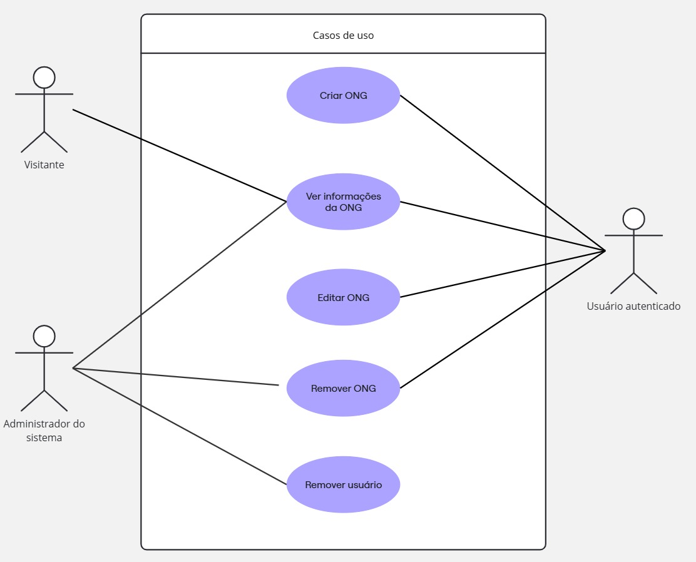

Requisitos funcionais (RF):

- Cadastro e login
- Adição de novas ongs
- Alteração nas informações da ONGS como endereço, necessidades, fontes de contatos
- Opção de busca por texto
- Filtrar por categoria da ONG
- Usuário “admin” e usuário “sou uma ong”

Requisitos não-funcionais (RNF):

- Acessibilidade no uso do site
- Otimização para carregamento rápido
- Usabilidade
- Responsividade para poder ser utilizado em diferentes dispositivos

Regras de negócio:

- Apenas pessoas que preencheram nome, email e senha poderão criar um usuário no site
- Apenas o usuário com a role 'Admin' poderá acessar a página de gerenciamento de usuários / ONGS
- Apenas usuários sem nenhuma ONG poderão criar uma nova ONG (máximo de 1 ONG por usuário)
- Apenas usuários que preencherem o nome, descrição, categória, endereço, telefone, email e escolherem uma imagem poderão criar uma ONG
- Apenas o usuário criador de uma ONG ou o Admin poderão remover uma ONG
- Apenas o usuário criador de uma ONG poderá edita-la
- Apenas o Admin poderá remover um usuário
- Se o usuário for Admin, não poderá criar uma ONG

Casos de Uso:

Perfis de usuários:

- Serão coletados dados dos usuários autenticados (criadores de ONGS), através deles poderemos analisar as categórias, as necessidades de itens e de voluntários mais comuns para as ONGS, além dos bairros de Fortaleza com a maior quantidade de ONGS. Com esses dados, ações voltadas para suprir as necessidade de cada ONG podem ser desenvolvidas futuramente
